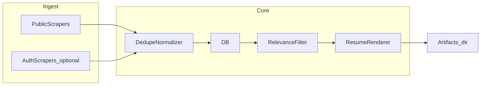

# Overnight job application pipeline (prep-only, hybrid sources)

## Clarified requirements (from you)

- **Output**: Scrape → dedupe → filter → generate tailored resume PDFs; **no automatic submission**.
- **Sources**: **Hybrid** — prioritize public pages and sanctioned APIs/RSS; **optional** Playwright-based modules **behind a feature flag** for personal-session sites (LinkedIn, Wellfound), with clear documentation that these paths may violate site ToS and are brittle.

## Recommended stack

| Area             | Choice                                                                                       | Rationale                                                                              |
| ---------------- | -------------------------------------------------------------------------------------------- | -------------------------------------------------------------------------------------- |
| Language         | Python 3.12+                                                                                 | Rich scraping/testing ecosystem                                                        |
| HTTP scraping    | `httpx` + optional `selectolax`/`beautifulsoup4`                                             | Async, testable with `MockTransport`                                                   |
| Dynamic / auth   | `playwright` (optional extra)                                                                | Only when `ENABLE_AUTH_SCRAPERS=1` (example)                                           |
| DB               | SQLite for single-machine overnight runs; swap DSN to Postgres later via SQLAlchemy          | Simple persistence; portable                                                           |
| Orchestration    | Single CLI entrypoint (`python -m pipeline run`) invoked by **cron** or **launchd** on macOS | No extra scheduler dependency unless you want APScheduler inside a always-on container |
| Resume PDF       | HTML + **Jinja2** → **WeasyPrint** (or **pdfkit**/wkhtmltopdf if you prefer)                 | Easier templating than raw ReportLab; version-control friendly                         |
| Config / profile | YAML or TOML (`config/profile.yaml`) + env for secrets                                       | Clear separation of preferences vs secrets                                             |

## High-level architecture



1. **Scraper registry**: Each board implements a small interface, e.g. `async def fetch_listings() -> list[RawListing]`, with shared rate limiting and retry (tenacity or manual exponential backoff + jitter).
2. **Normalization + dedupe**: Map raw rows to a canonical `JobRecord` (stable `source`, `source_id` or hash of canonical URL + normalized title/company). DB unique constraint on `(source, external_id)` or `(dedupe_key)`; upsert on conflict.
3. **Relevance filter**: Load user profile (skills list, seniority keywords, include/exclude title patterns, locations). Produce a score or boolean + reasons stored in DB or sidecar JSON for debugging.
4. **Resume generation**: One Jinja2 template per “base resume” variant; inject job-specific bullet ordering or a short “summary” paragraph generated locally (template + rules first; optional **local** LLM hook later as a separate phase — omit from v1 unless you ask).
5. **Overnight reliability**:
   - **Run manifest**: JSON log of per-scraper start/end, counts, errors (append-only).
   - **Per-scraper isolation**: Failure in one scraper does not abort others (try/except at adapter boundary).
   - **Idempotent DB writes**: Upserts only; no duplicate PDF overwrite unless `force_regenerate`.
   - **Exit codes**: Non-zero if any critical failure (config missing, DB unreachable); partial scraper failures logged as warnings with exit 0 or configurable strict mode.

## Auth-gated modules (feature-flagged)

- Separate package path, e.g. `scrapers/auth/` with `linkedin.py`, `wellfound.py`.
- **Gated by env** (e.g. `PIPELINE_AUTH_SCRAPERS=true` **and** presence of `PLAYWRIGHT_STORAGE_STATE` path to a pre-exported login state).
- Document workflow: one-time **manual** `playwright codegen` or small `login_export` script to create storage state; overnight job **consumes** state file — still unattended after that setup.
- Bot detection: realistic delays, single-browser context, minimal concurrency; no promise of evasion — plan assumes **best-effort** and graceful degradation (empty result + alert in manifest).

## Testing harness (no live calls)

- **tests/fixtures/**: Saved HTML/JSON snippets per board (minimal pages that exercise parsers).
- **HTTP**: `httpx.MockTransport` routing URL patterns to fixture bytes; parametrize tests per scraper.
- **Playwright**: Mark `@pytest.mark.integration`; default CI/offline runs **skip** auth tests; provide `tests/test_parsers_static.py` that feeds **saved DOM HTML** into extraction functions (no browser launch).
- Optional **VCR** (`pytest-recording` or `vcrpy`) for future live-record-once workflows — not required for v1 if fixtures are hand-curated.

## Repository layout (proposed)

```
cond-A/
  pyproject.toml
  README.md                 # setup, cron example, ToS disclaimer for auth scrapers
  config/
    profile.example.yaml
  src/pipeline/
    __main__.py             # CLI
    models.py               # SQLAlchemy models + Pydantic DTOs
    db.py
    dedupe.py
    filter_relevance.py
    resume_render.py
    orchestrator.py         # run phases + error boundaries
    scrapers/
      base.py
      public/               # e.g. greenhouse lever RSS or public job pages — start with 1–2 real public sources you choose
      auth/                 # feature-flagged
  tests/
    fixtures/
    test_scrapers_mocked.py
    test_dedupe.py
    test_filter.py
    test_resume_pdf.py      # snapshot or assert PDF bytes non-empty + metadata
  artifacts/              # gitignored — PDFs, logs
```

**Note**: Pick **concrete** initial public boards (e.g. company Greenhouse boards, Ashby public API, or a generic RSS) in implementation — the plan stays adapter-driven so adding boards is additive.

## Security and compliance

- Secrets only via environment or a gitignored `.env` (python-dotenv for local dev).
- README states: auth scrapers are **at your own risk**; prep-only pipeline does not submit forms.

## Implementation order

1. Project scaffold, profile schema, SQLAlchemy models, dedupe upsert.
2. One **fully mocked** public scraper + tests proving the harness.
3. Relevance filter + unit tests.
4. Jinja2 → PDF pipeline + one golden PDF test (file size / contains text via `pypdf`).
5. Orchestrator CLI + run manifest + cron/launchd snippet in README.
6. Second public scraper (different HTML shape) to validate adapter pattern.
7. Stub + feature-flagged Playwright adapter that reads static HTML in tests; real browser path documented for local only.
