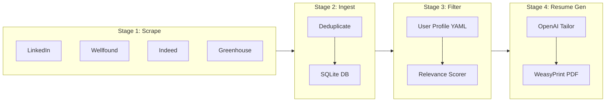

# Overnight Job Application Pipeline

## Overview

Build a Python-based automated overnight job application pipeline that scrapes listings from multiple boards (including auth-protected sites), deduplicates into a SQLite database, filters against a user profile, generates tailored resume PDFs via OpenAI, and runs unattended with full error recovery.

## Architecture



## Project Layout

```
job_pipeline/
├── config/
│   ├── settings.py            # Env-based config (Pydantic Settings)
│   └── user_profile.yaml      # Skills, seniority, role prefs, base resume
├── scrapers/
│   ├── base.py                # Abstract BaseScraper protocol
│   ├── linkedin.py            # Playwright + stealth, cookie-auth
│   ├── wellfound.py           # Playwright + stealth, cookie-auth
│   ├── indeed.py              # httpx + BeautifulSoup
│   └── greenhouse.py          # httpx + BeautifulSoup (board API)
├── db/
│   ├── models.py              # SQLAlchemy ORM models
│   ├── engine.py              # Engine/session factory
│   └── dedup.py               # Dedup logic (URL hash + fuzzy title)
├── filter/
│   └── matcher.py             # Keyword + optional LLM relevance scoring
├── resume/
│   ├── tailor.py              # OpenAI prompt to tailor bullets/summary
│   ├── renderer.py            # Jinja2 HTML -> WeasyPrint PDF
│   └── templates/
│       └── resume.html        # Professional resume HTML/CSS template
├── pipeline/
│   ├── orchestrator.py        # Stage runner with checkpoints and retries
│   └── recovery.py            # Crash recovery / partial-run resumption
├── tests/
│   ├── fixtures/              # Saved HTML snapshots per scraper
│   ├── conftest.py            # Shared fixtures (db session, mock scrapers)
│   ├── test_scrapers.py       # Test parsing logic against HTML fixtures
│   ├── test_dedup.py          # Dedup unit tests
│   ├── test_matcher.py        # Filtering/scoring tests
│   └── test_resume.py         # Resume tailoring + PDF rendering tests
├── pyproject.toml             # Dependencies, project metadata
├── .env.example               # Template for secrets
├── README.md                  # Setup + usage guide
└── run.py                     # CLI entry point (click)
```

## Component Design

### 1. Scraping Layer (`scrapers/`)

**Base protocol** (`scrapers/base.py`): every scraper implements `async def scrape(config) -> list[JobListing]` returning a standardized dataclass:

```python
@dataclass
class JobListing:
    source: str           # "linkedin", "wellfound", etc.
    external_id: str      # Platform-specific ID
    url: str
    title: str
    company: str
    location: str | None
    description: str
    posted_date: date | None
    raw_html: str         # For debugging / re-parsing
```

**Auth-protected scrapers** (LinkedIn, Wellfound):

- Use `playwright.async_api` with `playwright-stealth` plugin to avoid bot detection
- Authenticate via saved browser cookies (exported from a real session and stored in `.env` / a JSON file) — avoids fragile login-form automation
- Scroll-to-load handling: detect sentinel elements, scroll in a loop with randomized delays (1-3s jitter)
- Configurable search queries and filters passed from `user_profile.yaml`

**Static scrapers** (Indeed, Greenhouse):

- Use `httpx.AsyncClient` with rotating `User-Agent` headers
- Parse with `BeautifulSoup4` (lxml parser for speed)
- Greenhouse: hit the public JSON board API (`/boards/{company}/jobs`) — no HTML parsing needed

**Bot-detection mitigations** (all scrapers):

- Random inter-request delays (2-8s, configurable)
- User-Agent rotation from a curated list
- Playwright stealth patches (WebGL, navigator props, etc.)
- Exponential backoff on HTTP 429 / Captcha detection, with configurable max retries

### 2. Database Layer (`db/`)

**Engine** (`db/engine.py`): SQLAlchemy async engine + `sessionmaker`, defaulting to SQLite at `data/jobs.db`. Path configurable via `DATABASE_URL` env var.

**Models** (`db/models.py`):

| Table           | Key Columns                                                                                                                                         |
| --------------- | --------------------------------------------------------------------------------------------------------------------------------------------------- |
| `job_listings`  | `id`, `url_hash` (SHA-256, unique), `source`, `external_id`, `title`, `company`, `location`, `description`, `posted_date`, `raw_html`, `created_at` |
| `scraping_runs` | `id`, `source`, `started_at`, `finished_at`, `status`, `listings_found`, `error_message`                                                            |
| `applications`  | `id`, `listing_id` (FK), `resume_path`, `status`, `created_at`                                                                                      |

**Deduplication** (`db/dedup.py`):

- Primary dedup: SHA-256 hash of the canonical URL → `url_hash` unique constraint; `INSERT ... ON CONFLICT DO NOTHING`
- Secondary fuzzy dedup: normalize (company + title) and check for near-duplicates across sources using simple string similarity (SequenceMatcher, threshold 0.9)

### 3. Filtering Layer (`filter/matcher.py`)

**User profile** (`config/user_profile.yaml`):

```yaml
name: "Jane Doe"
target_roles: ["Software Engineer", "Backend Engineer", "Platform Engineer"]
seniority: ["mid", "senior"]
required_skills: ["Python", "AWS", "PostgreSQL"]
preferred_skills: ["Kubernetes", "Go", "Terraform"]
excluded_companies: ["Acme Corp"]
locations: ["San Francisco", "Remote"]
min_score: 0.6
base_resume:
  summary: "..."
  experience:
    - company: "..."
      role: "..."
      bullets: ["...", "..."]
  education: [...]
  skills: [...]
```

**Scoring algorithm**:

1. Hard filters (instant reject): excluded companies, seniority mismatch
2. Keyword scoring: weighted sum of skill matches in the description (required skills weighted 2x, preferred 1x), normalized 0-1
3. Role-title similarity: fuzzy match `target_roles` against listing title
4. Final score = weighted combination; listings above `min_score` pass

No LLM call needed here — pure keyword/fuzzy matching keeps this fast and free. LLM is reserved for resume tailoring.

### 4. Resume Generation (`resume/`)

**Tailoring** (`resume/tailor.py`):

- For each matched listing, call OpenAI `gpt-4o-mini` (cost-efficient) with a structured prompt:
  - System: "You are a resume writer. Given a base resume and a job description, rewrite the summary and tailor the bullet points to emphasize relevant experience. Output JSON."
  - Input: base resume from profile + job description text
  - Output: structured JSON with tailored `summary` and `bullets` per experience entry
- Rate-limit with `asyncio.Semaphore` (max 5 concurrent calls)
- Cache results keyed on `(listing_id, profile_hash)` to avoid re-generating on reruns

**PDF rendering** (`resume/renderer.py`):

- Load tailored JSON into a Jinja2 HTML template (`resume/templates/resume.html`) styled with professional CSS (clean fonts, proper margins, ATS-friendly single-column layout)
- Render HTML to PDF via `WeasyPrint`
- Save to `output/resumes/{company}_{title}_{date}.pdf`

### 5. Pipeline Orchestrator (`pipeline/orchestrator.py`)

**Execution model**: sequential stages, parallel within each stage where safe.

```python
async def run_pipeline(config):
    run_id = create_run_record()
    try:
        # Stage 1: Scrape (parallel across sources)
        listings = await scrape_all(config)

        # Stage 2: Ingest + dedup
        new_count = await ingest(listings)
        checkpoint(run_id, "ingested")

        # Stage 3: Filter
        matched = await filter_listings(run_id)
        checkpoint(run_id, "filtered")

        # Stage 4: Generate resumes (parallel with semaphore)
        await generate_resumes(matched)
        checkpoint(run_id, "completed")

    except Exception as e:
        log_failure(run_id, e)
        raise
```

**Error recovery** (`pipeline/recovery.py`):

- Each stage writes a checkpoint to the `scraping_runs` table
- On restart, `recover(run_id)` reads the last checkpoint and resumes from the next stage
- Individual scraper failures are caught and logged — the pipeline continues with remaining sources
- Transient errors (network, rate-limit) get exponential backoff retries (3 attempts, 10s/30s/90s)
- Fatal errors (auth expired, DB corrupt) halt with a clear error message and non-zero exit code

**Logging**: Python `logging` with `RotatingFileHandler` → `logs/pipeline.log`, plus console output. Structured JSON log format for machine parsing.

### 6. CLI Entry Point (`run.py`)

Uses `click`:

```
python run.py scrape          # Run only scraping stage
python run.py filter          # Run only filtering
python run.py generate        # Run only resume generation
python run.py full            # Run complete pipeline
python run.py resume --id 42  # Generate resume for a specific listing
```

For overnight scheduling, wrap with cron: `0 2 * * * cd /path && python run.py full >> logs/cron.log 2>&1`

### 7. Testing Harness (`tests/`)

**Strategy**: validate scraping *parsing* logic without hitting live sites.

- **HTML fixtures** (`tests/fixtures/`): save representative HTML snapshots from each site (one listing page, one search results page). Committed to the repo.
- **Scraper tests** (`test_scrapers.py`): load fixture HTML, pass it to the scraper's `parse_listings()` / `parse_detail()` methods, assert correct field extraction. No network calls.
- **Database tests** (`test_dedup.py`): in-memory SQLite, test insert + dedup + fuzzy matching.
- **Matcher tests** (`test_matcher.py`): test scoring with known profiles and listing descriptions — verify thresholds, hard filters, edge cases.
- **Resume tests** (`test_resume.py`): mock OpenAI responses (using `respx` or `unittest.mock`), verify JSON structure, render PDF and assert file exists and is non-empty.
- **Integration test**: wire mocked scrapers through the full pipeline, assert DB state and output files.

Run with: `pytest tests/ -v`

### 8. Dependencies (`pyproject.toml`)

Key packages:

- `playwright` + `playwright-stealth` — dynamic/auth scraping
- `httpx` — async HTTP for static scrapers
- `beautifulsoup4[lxml]` — HTML parsing
- `sqlalchemy[asyncio]` + `aiosqlite` — async ORM + SQLite
- `openai` — resume tailoring
- `weasyprint` — HTML-to-PDF
- `jinja2` — template rendering
- `pydantic-settings` — config management
- `click` — CLI
- `pyyaml` — user profile parsing
- `pytest` + `pytest-asyncio` + `respx` — testing

## Key Design Decisions

- **SQLite over Postgres**: no external service to manage; perfect for a single-user overnight job. Upgrade path via `DATABASE_URL` env var if needed later.
- **Cookie-auth over login automation**: login flows are the most fragile part of scraping; exporting cookies from a real browser session is more reliable and sidesteps 2FA/captcha entirely.
- **Separate parse from fetch in scrapers**: the `parse_*` methods take raw HTML, making them testable without network calls. The `fetch_*` methods handle Playwright/httpx concerns.
- **gpt-4o-mini for tailoring**: balances cost (~$0.15/1M input tokens) with quality for resume text rewriting. One call per listing keeps the OpenAI bill under ~$1/night for typical volumes.
- **Checkpoint-based recovery**: simpler than a full workflow engine; each stage is idempotent so reruns are safe.
