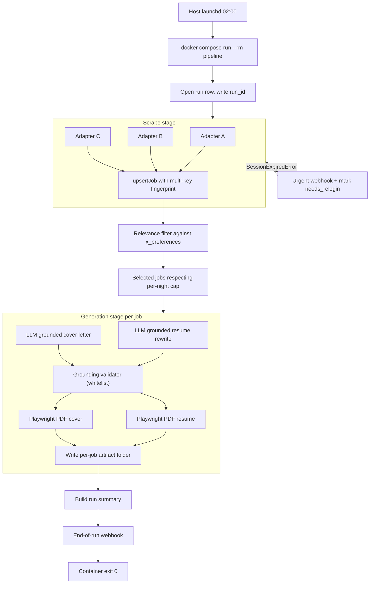

# Overnight Job Application Pipeline

**Companion artifacts:** [decision_graph.json](decision_graph.json) (machine-readable decisions, risks, tests, edges) and [GRAPH_MAINTENANCE.md](GRAPH_MAINTENANCE.md) (how to update the graph while implementing).

**Overview:** A TypeScript-on-Node pipeline running in a Docker container that nightly scrapes public ATSes plus LinkedIn/Wellfound (via persisted sessions), deduplicates and filters listings against a JSON Resume profile, and produces a per-job artifact folder containing a tailored, hallucination-guarded resume PDF and cover letter PDF for human review next morning.

---

## 1. Locked decisions (the architecture in one screen)

- Runtime: **Node.js + TypeScript**, single-language stack.
- Browser: **Playwright (Chromium)** with `BrowserContext.storageState` for session reuse.
- Auth: **mixed** — manual one-shot login per protected board (LinkedIn, Wellfound) writes a `storageState` JSON; public ATSes (Greenhouse, Lever, Ashby, public LinkedIn job search, public company pages) scraped unauthenticated.
- DB: **SQLite via `better-sqlite3` + Drizzle** on a Docker volume.
- LLM: **Hosted API** (OpenAI / Anthropic) in JSON mode, used in **grounded-rewrite mode only** (cannot introduce employers/dates/skills/titles not in master profile).
- Profile: **JSON Resume v1 + `x_preferences` extension** as canonical source. Bootstrapped once from the user's existing PDF/DOCX via an LLM-assisted CLI with a manual review checkpoint.
- Output: **artifacts only, no auto-apply**. Per-job folder with `resume.pdf`, `cover_letter.pdf`, `listing.json`, `prompt.md`, `generation_meta.json`, `apply_url.txt`.
- Deployment: **Docker container** based on `mcr.microsoft.com/playwright`, scheduled nightly by **host launchd**.
- Notification: **Slack/Discord webhook** — both an end-of-run summary and **immediate urgent alerts** for session expiry / sustained LLM outage.
- Error handling: **per-stage retry with backoff + per-adapter circuit breaker**; **DB checkpointing** so a killed container resumes without redoing completed stages; **bounded concurrency** (default 3 boards in parallel, serial within a board with 1.5–4s jitter).
- Tests: **three layers** — unit (per-adapter HTML fixtures), conformance (every adapter satisfies the contract and produces schema-valid output), integration (full pipeline with mock adapters + mock LLM + temp SQLite). Plus dedicated tests for grounding, dedup, notifier-always-fires, session-expiry signal, and PDF snapshots.

## 2. Repository layout

```
cond-B/
  docker/
    Dockerfile
  docker-compose.yml
  Makefile                       # convenience targets: login, bootstrap, run, test
  package.json
  tsconfig.json
  drizzle.config.ts
  config/
    boards.yml                   # enabled adapters, queries, per-board listing caps
    pipeline.yml                 # concurrency, retries, time budget, generation cap
    notify.yml                   # webhook urls + thresholds
  profile/
    master.example.json          # JSON Resume + x_preferences template
    master.json                  # gitignored, the user's real profile
  prompts/
    resume_tailor.md
    cover_letter.md
    profile_bootstrap.md
  templates/
    resume/default.hbs           # Handlebars + CSS
    resume/default.css
    cover_letter/default.hbs
  src/
    cli/
      run.ts                     # nightly entrypoint
      login.ts                   # capture storageState for one site
      bootstrap.ts               # PDF/DOCX -> JSON Resume (one-shot)
      record-fixture.ts          # save HTML for a URL into tests/fixtures/
    orchestrator/
      run.ts                     # the staged run loop
      checkpoint.ts              # stage state machine on top of DB
    scrapers/
      engine.ts                  # Playwright context manager + adapter dispatcher
      stealth.ts                 # UA, viewport, navigator tweaks
      session.ts                 # storageState load/save, SessionExpiredError
      adapters/
        base.ts                  # ScraperAdapter interface + helpers
        greenhouse.ts
        lever.ts
        ashby.ts
        linkedin.ts
        wellfound.ts
        company-careers.ts       # generic adapter for company career pages
        index.ts                 # registry
    db/
      schema.ts                  # Drizzle: runs, jobs, fingerprints, generations, errors, adapter_health
      repo.ts                    # typed CRUD + dedup queries + checkpoint queries
      migrate.ts
    filter/
      score.ts                   # weighted score against x_preferences
      rules.ts                   # hard exclusions
    generation/
      grounding.ts               # build whitelist from master profile + validate LLM output
      resume.ts                  # tailor resume JSON
      cover.ts                   # tailor cover letter
      pdf.ts                     # Handlebars -> Playwright page.pdf
      artifacts.ts               # compose everything into per-job folder
    llm/
      client.ts                  # OpenAI/Anthropic SDK wrapper (retry, JSON mode, cost)
      mock.ts                    # deterministic mock for tests
      schemas.ts                 # zod schemas for structured outputs
    notify/
      webhook.ts                 # POSTs run summary + urgent alerts
      format.ts
    util/
      retry.ts                   # exponential backoff + jitter + circuit breaker
      logger.ts                  # pino, run_id-keyed JSON logs
      fingerprint.ts             # multi-key fingerprint helpers
    types/
      job.ts                     # Job + RawListing + zod schema
      profile.ts                 # JSONResume + x_preferences zod
      run.ts                     # RunSummary, UrgentAlert
  tests/
    fixtures/
      greenhouse/<saved.html>
      lever/<saved.html>
      ...
      profiles/master.test.json
      llm/canned-tailored.json
    adapters/
      *.test.ts
    conformance/
      adapter.test.ts
    integration/
      orchestrator.test.ts
      notifier.test.ts
      session-expired.test.ts
    grounding/
      validator.test.ts
    dedup/
      fingerprint.test.ts
    pdf/
      snapshot.test.ts
  data/                          # mounted volume, gitignored
    db/
    sessions/                    # one storageState JSON per protected site
    outputs/<YYYY-MM-DD>/<company>__<title>__<id>/
    logs/<run_id>.log
```

## 3. Key contracts

```ts
export interface Job {
  id: string;                  // db pk (uuid)
  source: string;              // 'greenhouse' | 'lever' | 'linkedin' | ...
  sourceId: string;            // adapter-native id
  url: string;
  title: string;
  company: string;
  location?: string;
  remote?: 'remote' | 'hybrid' | 'onsite' | 'unknown';
  postedAt?: string;           // ISO
  scrapedAt: string;
  descriptionHtml: string;
  descriptionText: string;
  salary?: { min?: number; max?: number; currency?: string };
  seniority?: string;
  fingerprintPrimary: string;  // (source, sourceId)
  fingerprintCanonical: string;// SHA256(company+title+normalised_url)
  fingerprintContent: string;  // SHA256(normalised description)
  raw: unknown;                // adapter-native payload, kept for replay
}

export interface ScraperAdapter {
  id: string;
  requiresAuth: boolean;
  list(query: AdapterQuery, ctx: AdapterCtx): AsyncIterable<RawListing>;
  enrich?(listing: RawListing, ctx: AdapterCtx): Promise<RawListing>;
  // Adapter inspects the page (URL, selectors) to detect login redirect / captcha:
  detectSessionExpired?(page: import('playwright').Page): Promise<boolean>;
}

export interface UserProfile extends JSONResume {
  x_preferences: {
    target_roles: string[];
    seniority: 'junior' | 'mid' | 'senior' | 'staff' | 'principal';
    locations: string[];
    remote_pref: 'remote_only' | 'hybrid_ok' | 'any';
    exclude_keywords: string[];
    min_salary?: number;
  };
}

export interface RunSummary {
  runId: string;
  startedAt: string; finishedAt: string;
  perAdapter: Array<{
    id: string; listed: number; new: number;
    errors: number; circuitTripped: boolean; needsRelogin: boolean;
  }>;
  filteredIn: number;
  generated: number;
  failures: Array<{ stage: string; jobId?: string; error: string }>;
  sessionsExpired: string[];
}
```

## 4. Run flow



The orchestrator wraps the whole thing in a `try/finally` so the notifier is invoked even on uncaught errors. Per-job failures are caught and recorded in the `errors` and `generations` tables; they never abort the run.

## 5. Error handling and recovery (the unattended part)

- **Per-call retry**: `comp_retry` wraps every network/LLM call. Default policy: `attempts=4, base=500ms, factor=2, jitter=±30%`, configurable per stage in `config/pipeline.yml`.
- **Circuit breaker per adapter**: on N consecutive failures (default 5), the adapter is short-circuited for the rest of the run; recorded in `adapter_health`.
- **Session expiry**: each adapter's `detectSessionExpired(page)` is called after every page load. On `true`, throw `SessionExpiredError` -> orchestrator marks `adapter_health.needs_relogin = true`, fires an **urgent webhook** with `kind: 'session_expired'`, and continues with the remaining adapters. Future runs auto-skip until `npm run login -- linkedin` is re-run.
- **Crash resume**: Stages write `runs.stage_completed_at_*` and per-job `jobs.scraped_at` / `filtered_at` / `generations.status`. Re-running with `--resume <run_id>` continues after the last completed stage. Launchd retry triggers the same run_id if the container exited non-zero in the last hour.
- **Wall-clock guard**: `pipeline.yml` defines `max_runtime_minutes` (default 240). A timer in the orchestrator forces a graceful drain at the budget limit — finish in-flight per-job generation, write summary, exit.
- **Generation cap**: `pipeline.yml` defines `max_generations_per_run` (default 30) to bound LLM cost.
- **Output cleanup**: artifacts older than `retention_days` (default 14) are pruned at the start of each run.

## 6. Bot-detection mitigations

- Playwright with `mcr.microsoft.com/playwright` browsers — `stealth.ts` applies sane defaults (real UA matching browser version, viewport jitter, language headers, `webdriver` deletion).
- Polite request cadence per board: jittered delays, per-board listing cap, scroll rather than click-pagination where possible.
- Per-page detection probes (looking for known captcha/challenge selectors and login redirects) — surface as `SessionExpiredError`, never silently treat as "no results".
- Each adapter's listing yields a sentinel error if the page returned an unexpectedly-empty result set after pagination — this prevents DOM drift from looking like "0 jobs today".

## 7. Resume tailoring without hallucination

The grounding contract is the most important quality property. The shape:

1. `grounding.ts` parses the master profile into a **whitelist** of allowed tokens: every company name, every employer date, every skill, every job title, every degree, every certification.
2. The LLM call (`generation/resume.ts`) provides:
   - The full master JSON Resume as `system` context.
   - The job description.
   - A prompt instructing it to (a) reorder bullets, (b) rewrite phrasing for resonance with the JD, (c) emphasise matching skills. **Forbidden**: introducing new companies, dates, titles, skills, accomplishments.
   - JSON mode with a strict zod schema (a `JSONResume` subset).
3. The validator inspects the returned JSON for: companies/titles/dates/skills not in the whitelist, suspicious numerics ("led team of 50" if no master mention), and resume length sanity.
4. On rejection: one regeneration attempt with the validation errors fed back in. Second failure logs `generations.status='rejected_grounding'`, the job is skipped, and the failure appears in the summary. (Test: `tst_resume_grounding`, `tst_resume_cover_grounding`.)
5. The cover letter follows the same flow with a separate prompt; same whitelist, slightly looser narrative tone.

## 8. Testing strategy (no live calls anywhere)

- **Unit (per-adapter)**: each adapter has saved HTML fixtures under `tests/fixtures/<adapter>/`. Tests use Playwright's `page.route` to intercept network responses with the saved HTML, run the adapter, and assert on the produced `Job` object. Helper CLI `record-fixture.ts` saves HTML pages for new adapters or refreshing fixtures.
- **Conformance**: a single test loops `Object.values(adapters)`, runs each against its fixtures, validates output with the `Job` zod schema, and checks `requiresAuth` consistency.
- **Integration**: `tests/integration/orchestrator.test.ts` wires up mock adapters (yielding fixture jobs), `llm/mock.ts` (deterministic JSON), and a temp SQLite. Asserts: dedup collapses cross-board duplicates, filter rejects irrelevant jobs, per-job folders are written with all six files, run summary contains expected counts, notifier is called exactly once.
- **Notifier-always-fires**: orchestrator with all stages forced to throw -> notifier still called from `finally` with a failure summary.
- **Session-expired**: an adapter that throws `SessionExpiredError` -> `adapter_health.needs_relogin` is set, urgent webhook fired, run continues, summary includes the adapter in `sessionsExpired`.
- **Grounding**: hand-crafted adversarial LLM mock outputs (fabricated company "FakeCorp Ltd", swapped dates, invented "Rust" skill) -> validator rejects with named violations.
- **Dedup**: property-based (fast-check) — same listing with permuted casing, trailing slashes, stripped query params, mirrored on multiple boards collapses to one row; genuinely different listings don't.
- **PDF snapshot**: render fixed JSON Resume + cover letter through templates, extract text from the resulting PDF (e.g. `pdf-parse`), assert against snapshot. Catches CSS/template regressions.
- **CI**: `npm test` runs all of the above offline. Playwright is launched in `chromium` headless. No network egress required.

## 9. One-time setup and nightly operation

- `npm install`
- `make build` — builds the Docker image.
- `make bootstrap` — runs `bootstrap.ts` against the user's existing PDF/DOCX, opens the resulting `profile/master.json` in `$EDITOR` for review.
- `make login SITE=linkedin` — opens headed Chromium, user logs in, `data/sessions/linkedin.json` written.
- `make login SITE=wellfound` — same.
- Edit `config/boards.yml`, `config/pipeline.yml`, `config/notify.yml`.
- `make run-once` — runs the pipeline immediately for a smoke test.
- Install the launchd plist (`com.user.condb.nightly.plist`, included) — runs `docker compose run --rm pipeline` at 02:00 nightly. Logs in `data/logs/<run_id>.log`.

## 10. Open assumptions to monitor (graph callouts with confidence < 0.7)

- `asm_session_longevity` (0.5) and `asm_no_midrun_captcha` (0.5): mitigated operationally — the urgent-alert path makes failure visible the same night, and the `needs_relogin` flag prevents wasted attempts on subsequent runs. Will need real-world calibration; consider a "session warmth" cron that opens the LinkedIn home page once a day to keep the session active.
- `asm_dom_stable` (0.5): mitigated by the conformance suite catching parser breakage on fixture refresh, and by the empty-result-set sentinel detecting silent breakage.
- `asm_tos_personal_use` (0.6): explicit user acknowledgement; mitigated by polite-concurrency defaults and per-board listing caps.

## 11. Build sequence

The implementation order below sequences the build so that the testing harness, the grounding guard, and the notifier all exist before the LinkedIn/Wellfound adapters or the production wiring. The riskiest pieces (silent failures, hallucinated resumes) are guarded *before* they have anything to fail on.

## 12. Implementation checklist (sync with code + graph)

Track progress here and in [decision_graph.json](decision_graph.json) (`test` nodes `status`, new `component` `file_refs`, `changelog`).

1. **scaffold** — Scaffold the TS Node project: `package.json`, `tsconfig.json`, Drizzle config, Dockerfile based on `mcr.microsoft.com/playwright`, `docker-compose` with volumes for `data/` and `config/`, Makefile with `build` / `run-once` / `test` / `login` / `bootstrap` targets, `.gitignore` for `profile/master.json` and `data/`.
2. **types_and_schemas** — Define core TS types and zod schemas in `src/types/`: Job, RawListing, UserProfile (JSONResume + x_preferences), RunSummary, UrgentAlert.
3. **db_layer** — Implement `src/db/`: Drizzle schema, `src/util/fingerprint.ts`, `src/db/repo.ts`, migrations; property tests for fingerprint.
4. **logger_retry_circuit** — `src/util/logger.ts` (pino), `src/util/retry.ts` (backoff + circuit breaker); unit tests.
5. **test_harness** — Offline test harness: `tests/fixtures/`, `src/cli/record-fixture.ts`, test helpers, `src/llm/mock.ts`.
6. **scraper_engine** — `engine.ts`, `stealth.ts`, `session.ts`, `adapters/base.ts`.
7. **public_adapters** — Greenhouse, Lever, Ashby with fixtures and conformance.
8. **linkedin_wellfound** — LinkedIn + Wellfound adapters, `login.ts`, session-expired fixtures.
9. **filter** — `src/filter/score.ts`, `rules.ts` with unit tests.
10. **llm_client_and_grounding** — `src/llm/client.ts`, `src/generation/grounding.ts`, adversarial tests.
11. **pdf_renderer_and_templates** — `src/generation/pdf.ts`, templates, PDF snapshot tests.
12. **resume_and_cover_gen** — `resume.ts`, `cover.ts`, prompts, mock LLM tests.
13. **artifact_writer** — `artifacts.ts` and six-file folder tests.
14. **notifier** — `webhook.ts`, `format.ts`, notifier-always-fires test.
15. **orchestrator** — `run.ts`, `checkpoint.ts`, session urgent path, `try/finally` notifier.
16. **integration_tests** — Full mock pipeline, crash resume, session-expired flow.
17. **profile_bootstrap_cli** — `bootstrap.ts` PDF/DOCX path.
18. **run_cli_and_launchd** — `run.ts`, plist template, docs.
19. **configs_and_examples** — Example YAML/JSON under `config/` and `profile/`.
20. **readme_and_runbook** — Root `README.md` with quick-start, ToS caveat, runbook.
