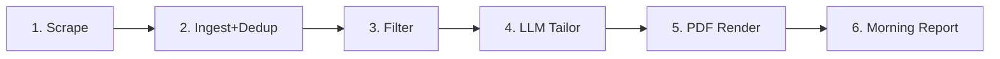

# Overnight Job Application Pipeline

## Technology Stack

- **Runtime**: Python 3.12+
- **Browser automation**: Playwright + playwright-stealth
- **Database**: SQLite via SQLAlchemy (swappable to Postgres)
- **LLM**: OpenAI / Anthropic SDK (configurable provider)
- **PDF**: WeasyPrint (HTML/CSS to PDF)
- **Config**: YAML (pydantic for validation)
- **Testing**: pytest + recorded HTML fixtures
- **Packaging**: pyproject.toml (hatchling), Docker for portability

## Pipeline Data Flow



Each stage persists results to the database. If the pipeline crashes, it resumes from the last incomplete stage using checkpoint records.

## Project Structure

```
llm-planning-proj1-B/
  pyproject.toml
  Dockerfile
  docker-compose.yml
  README.md
  config/
    profile.yaml          # user skills, experience, base resume
    boards.yaml           # per-board scraping config + selectors
    .env.example          # API keys, cookie paths
  src/jobpipe/
    __init__.py
    main.py               # CLI entry (click)
    pipeline.py           # stage orchestrator + checkpointing
    scraper/
      __init__.py
      base.py             # BaseAdapter ABC
      linkedin.py         # LinkedIn adapter
      wellfound.py        # Wellfound adapter
      generic.py          # CSS-selector-driven generic adapter
      stealth.py          # Playwright stealth browser factory
    db/
      __init__.py
      models.py           # SQLAlchemy models (JobListing, RunLog, Checkpoint)
      store.py            # upsert, dedup, query helpers
    filter/
      __init__.py
      matcher.py          # keyword + seniority scoring, optional LLM semantic match
    resume/
      __init__.py
      tailor.py           # LLM prompt construction + response parsing
      renderer.py         # Jinja2 template + WeasyPrint render
      templates/
        default.html      # HTML/CSS resume template
    report.py             # morning summary generator (HTML + Markdown)
    utils/
      __init__.py
      logging.py          # structured JSON logging
      retry.py            # exponential backoff + circuit breaker
  tests/
    conftest.py           # shared fixtures, DB factory, mock LLM
    fixtures/             # saved HTML pages from each board
      linkedin_search.html
      wellfound_listings.html
    test_scraper.py       # adapter parsing tests against fixtures
    test_store.py         # dedup + CRUD tests
    test_matcher.py       # relevance scoring tests
    test_tailor.py        # LLM prompt/response tests with mocked API
    test_pipeline.py      # end-to-end stage orchestration tests
  output/                 # generated resumes + reports (gitignored)
```

## Key Components

### 1. Scraper Engine (`src/jobpipe/scraper/`)

- **`base.py`**: `BaseAdapter` ABC with methods `async scrape(config) -> list[JobListing]` and `async login(credentials) -> None`. All adapters normalize output to the common job listing schema.
- **`stealth.py`**: Factory function that creates a Playwright browser context with `playwright-stealth` patches, randomized viewport/user-agent, and configurable proxy support.
- **`linkedin.py`**: Loads saved cookies from a browser profile directory, navigates LinkedIn job search with configurable query params, scrolls to load all results, extracts listing cards. Defers to `stealth.py` for browser setup.
- **`wellfound.py`**: Similar pattern for Wellfound; handles React hydration waits.
- **`generic.py`**: Driven by `boards.yaml` CSS selectors -- users can add new boards without writing Python.
- **Rate limiting**: Each adapter respects a configurable `min_delay_ms` between page loads. Randomized jitter (1x-2x) to reduce fingerprinting.

### 2. Database Layer (`src/jobpipe/db/`)

- **`models.py`**: SQLAlchemy declarative models:
  - `JobListing`: title, company, url (unique with source), source, location, description, tags (JSON), scraped_at, raw_html, relevance_score (nullable), status enum (new/relevant/tailored/skipped).
  - `RunLog`: run_id, started_at, finished_at, stage_reached, error_log.
  - `Checkpoint`: run_id, stage, item_id -- tracks which items in a stage were processed.
- **`store.py`**: `upsert_listing()` uses `INSERT OR IGNORE` on `(url, source)` composite unique constraint for deduplication. Batch operations for efficiency.

### 3. Relevance Filter (`src/jobpipe/filter/`)

- **`matcher.py`**: Two-tier scoring:
  1. **Fast pass** (keyword): TF-IDF or simple keyword overlap between job description and user's skill list + role preferences. Cheap, runs on all listings.
  2. **Semantic pass** (optional, LLM): For borderline scores, send job description + profile to LLM for a relevance judgment. Controlled by a configurable threshold.
- Scores saved to `JobListing.relevance_score`; configurable cutoff determines which jobs proceed to tailoring.

### 4. Resume Tailor (`src/jobpipe/resume/tailor.py`)

- Constructs a structured prompt: system message with formatting rules, user's base resume as JSON, job description, and instruction to produce a tailored resume.
- **Hallucination guard**: Prompt explicitly instructs the LLM to only use facts from the base resume. Post-processing validates that no new employers/degrees appear.
- **Budget cap**: Configurable `max_tailored_per_run` (default 20) to control LLM API costs.
- Returns a `TailoredResume` pydantic model with sections: summary, experience (list), skills, education, projects.

### 5. PDF Renderer (`src/jobpipe/resume/renderer.py`)

- Loads `templates/default.html` (Jinja2 template with embedded CSS).
- Fills template with `TailoredResume` data.
- Calls `weasyprint.HTML(string=html).write_pdf()`.
- Output path: `output/{run_date}/{company}_{title}.pdf`.

### 6. Pipeline Orchestrator (`src/jobpipe/pipeline.py`)

- Stages enum: `SCRAPE -> INGEST -> FILTER -> TAILOR -> RENDER -> REPORT`.
- On start, creates a `RunLog` entry. Each stage updates `stage_reached`.
- **Checkpoint logic**: Before processing each item in TAILOR/RENDER, writes a `Checkpoint` row. On resume, skips already-checkpointed items.
- **Retry**: Transient errors (network, rate limit) get exponential backoff (3 retries, base 30s). After max retries, logs error and continues to next item (no pipeline halt for single-item failures).
- **Circuit breaker**: If >50% of items in a stage fail, halt that stage and proceed to report (partial results are better than none).

### 7. Morning Report (`src/jobpipe/report.py`)

- Generates `output/{run_date}/report.html` and `report.md`.
- Sections: run summary (boards scraped, counts), relevant job table (title, company, score, link), tailored resume links, errors/warnings.

### 8. Configuration (`config/`)

- **`profile.yaml`**: User identity, skills list, seniority level, preferred roles, locations, salary range, base resume content (all sections).
- **`boards.yaml`**: Per-board: enabled flag, adapter class, search queries, max pages, auth method, CSS selectors (for generic adapter).
- **`.env`**: `OPENAI_API_KEY`, `ANTHROPIC_API_KEY`, `LLM_PROVIDER` (openai|anthropic), `LLM_MODEL`, cookie file paths.

### 9. Test Harness (`tests/`)

- **Fixture capture**: A utility script (`scripts/capture_fixtures.py`) that runs real scraping once and saves the raw HTML to `tests/fixtures/`.
- **Scraper tests**: Load fixture HTML into a mock Playwright page (using `page.set_content()`), run adapter's parsing logic, assert extracted fields.
- **Store tests**: Use an in-memory SQLite database. Test upsert dedup, checkpoint queries.
- **Tailor tests**: Mock the LLM API client, assert prompt structure, validate hallucination guard on canned responses.
- **Pipeline tests**: Mock all external I/O (Playwright, LLM API), test stage sequencing, checkpoint/resume, circuit breaker behavior.

## Risk Mitigations

| Risk | Mitigation |
| ---- | ---------- |
| Bot detection breaks scraping | playwright-stealth + configurable proxy rotation + randomized delays. Alert in report if a board returned 0 results (likely blocked). |
| DOM changes break adapters | Each adapter has a `SCHEMA_VERSION` constant. Tests against fixtures catch regressions. Log warnings when expected selectors return 0 matches. |
| LLM hallucinates resume content | Post-processing diff between base resume facts and LLM output. Flag and exclude any tailored resume that introduces new employers or degrees. |
| Auth cookies expire mid-run | Scrape auth-protected boards first (freshest cookies). If a 401/redirect-to-login is detected, log the failure and skip that board. |
| LLM cost spike | `max_tailored_per_run` budget cap. Track token usage per run in `RunLog`. |
| macOS sleeps through cron | Use `pmset` to schedule wake, or prefer Docker on an always-on machine. |

## Entry Points

- **`python -m jobpipe run`**: Execute full pipeline once.
- **`python -m jobpipe run --resume`**: Resume from last checkpoint.
- **`python -m jobpipe scrape --board linkedin`**: Run scraping only for one board.
- **`python -m jobpipe test-auth --board linkedin`**: Validate auth cookies work.
- **`pytest tests/`**: Run full offline test suite.
- **Cron**: `0 2 * * * cd /path && python -m jobpipe run >> logs/cron.log 2>&1`

## Implementation Order

The build order follows the data flow, with the database and interfaces established first since everything depends on them.

1. Project scaffold (pyproject.toml, package structure, README, Dockerfile)
2. Database layer (models, store with dedup)
3. Configuration system (pydantic schemas, sample YAML files)
4. Scraper engine (base adapter, stealth factory, rate limiting)
5. Site adapters (LinkedIn, Wellfound, generic)
6. Relevance filter (keyword pass, optional LLM semantic pass)
7. Resume tailor (LLM prompts, hallucination guard, budget cap)
8. PDF renderer (Jinja2 template, WeasyPrint)
9. Pipeline orchestrator (stage sequencing, checkpointing, retry, circuit breaker)
10. Morning report generator
11. CLI entry points
12. Test harness (fixtures, scraper/store/tailor/pipeline tests)
13. Docker containerization

## Decision Graph

The full architectural decision graph (objectives, requirements, decisions, components, interfaces, assumptions, and risks with all edges) is saved separately in `decision_graph.json`.
