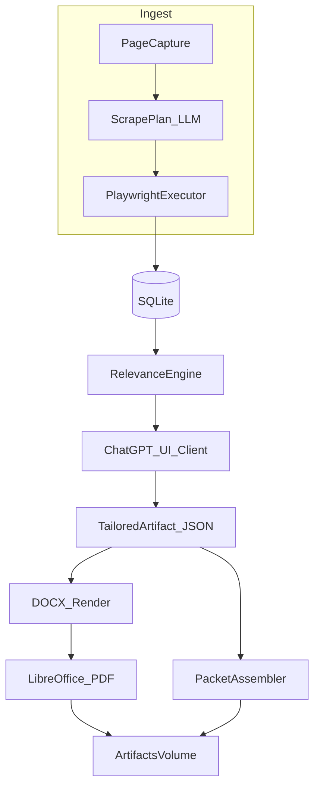

# Overnight job application prep pipeline

**Status:** planning artifact (no implementation yet).  
**Decision graph:** canonical machine-readable graph is [`decision_graph.json`](decision_graph.json) (`nodes` + `edges`). The JSON file adds `req_defer_tailoring_on_failure` and `implements(comp_orchestrator → req_defer_tailoring_on_failure)` so defer-on-failure is modeled as a requirement rather than `implements → decision`.

## Overview

Greenfield Python + Playwright pipeline in local Docker: scrape LinkedIn, Wellfound, and one ATS-style public board with conservative throttles; persist deduped listings in SQLite; rank against a profile; drive ChatGPT via browser UI for structured tailoring and scrape planning; render DOCX to PDF with LibreOffice; assemble application packets—with fixture-based offline tests and checkpointed error recovery.

## Architecture diagram

## Repository layout (proposed under repo root)

- `docker/` — `Dockerfile`, `docker-compose.yml`, LibreOffice setup
- `src/jobpipe/` — package root
  - `cli.py` — `jobpipe run`, `jobpipe refresh-auth`, `jobpipe doctor`
  - `orchestrator/` — stage machine, checkpoints, run reports
  - `scraping/` — rate limits, capture, plan execution, site registry
  - `llm/chatgpt_ui/` — queued Playwright client + schema parsing
  - `db/` — models, migrations, dedupe keys
  - `relevance/` — scoring + explanations
  - `render/` — docxtpl fill + LibreOffice export
  - `packets/` — cover letter + answers writers
- `schemas/` — JSON Schema for tailored artifact and scrape plan
- `tests/fixtures/` — HTML/a11y captures, golden JSON outputs
- `config/` — example profile YAML + template mapping YAML
- `volumes/` (gitignored usage only) — mount points: `data/`, `secrets/`, `artifacts/`, `templates/`

## Deduping and persistence

- **Dedupe key:** prefer stable `(source, source_job_id)` when available; else hash canonicalized `(canonical_url, title, company, posted_at?)` with collision handling logged.
- **Tables (conceptual):** `jobs`, `job_runs`, `scrape_events`, `artifacts` (paths + hashes), `deferred_jobs` (reason codes: `tailoring_schema`, `chatgpt_ui`, `session`, `plan_validation`).

## Scraping workflow (conservative + LLM plan)

1. **Discover** with hard per-domain limits; record run checkpoints after each board slice.
2. **Capture** `iface_page_capture` (trimmed HTML + accessibility snapshot).
3. **Plan:** enqueue LLM request via ChatGPT UI client to emit `iface_scrape_plan` JSON; validate against schema + static safety rules (allowed actions only).
4. **Execute plan** in Playwright; validate extraction counts and required fields; on failure, do not persist partial listings—mark board slice degraded and continue.
5. **Normalize** to `iface_normalized_job` and upsert into SQLite.

## Tailoring + deferral

- Strict prompt template requiring **JSON-only** output matching the tailored-artifact schema.
- On parse/validation failure or UI errors: **defer job** — write DB row with reason, skip PDF/packet for that job, continue pipeline.
- **Single ChatGPT UI session:** serialize planner + tailor requests through one queue to avoid concurrent automation.

## DOCX + PDF

- Authoritative template: mounted `templates/resume.docx` + `config/docx_mapping.yaml`.
- Fill via **docxtpl**; export PDF via **`soffice --headless`** with pinned fonts where possible.

## Overnight operation + recovery

- **Checkpoint** after: each board ingest, relevance batch, each tailoring batch, each render batch.
- **Retries:** exponential backoff for transient Playwright errors; cap per stage; never spin forever.
- **Idempotency:** reruns skip already-processed `(job_id, stage)` tuples.
- **Scheduling:** host `cron` or `launchd` invoking `docker compose run --rm jobpipe run` (exact command to live in README when implemented).

## Testing harness (no live sites)

- **Fixture tests** for HTML to normalized job extraction per adapter variant you snapshot.
- **Plan replay tests:** checked-in page capture + scrape plan to expected extracted rows (executor in isolation).
- **Tailoring conformance:** golden strings (simulated model output) to schema validation + optional renderer smoke.

## Security and secrets

- Mount `secrets/` read-only: ChatGPT storage state, board `storageState` files, any tokens.
- Never commit secrets; provide `.env.example` with paths only.

## Implementation sequencing

1. **Skeleton:** Docker + CLI + SQLite + run metadata + checkpoint model.
2. **Scraping core:** rate limiter, capture format, plan schema validation, executor loop, LinkedIn/Wellfound/ATS stubs behind interfaces.
3. **Offline fixtures + pytest** for normalization and plan replay.
4. **Relevance engine** + profile config.
5. **ChatGPT UI client** + JSON schema enforcement + deferral behavior.
6. **DOCX render + LibreOffice PDF** + packet outputs.
7. **Hardening:** circuit breakers, run report HTML/Markdown, `doctor` command for mounts/secrets/LibreOffice.

## Explicit non-goals (v1)

- Autonomous job submission.
- Guaranteed bypass of strong bot defenses (design assumes **conservative** operation and accepts partial deferral).

## Implementation todos (from planning session)

- [ ] Add Docker/LibreOffice image, Python package skeleton, CLI entrypoints, SQLite + migrations, run/checkpoint tables
- [ ] Implement capture bundle, scrape plan schema/validator, Playwright executor, per-site registry (LI/WF/ATS), rate limiter
- [ ] Add pytest fixtures for HTML/a11y captures; normalization tests + plan replay tests without network
- [ ] Profile YAML + relevance scoring with explainability + persistence of scores
- [ ] Queued ChatGPT UI automation, JSON schema validation, defer-job policy + reasons in DB
- [ ] docxtpl mapping, LibreOffice headless PDF export, packet file outputs under artifacts volume
- [ ] Idempotent stages, retries/backoff, circuit breakers, launchd/cron docs, `doctor` + run report
